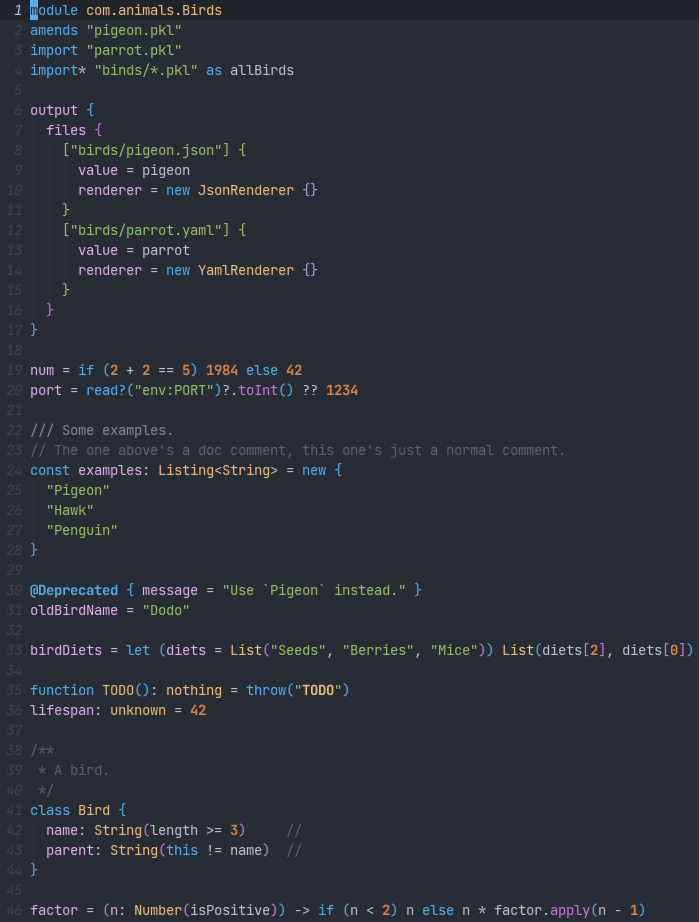

# `pkl-mode`

Major mode for editing [Pkl](https://pkl-lang.org/) files.



## Installation

Below are instructions for `use-package`. If you don't use `use-package`, you can
just add the `pkl-mode.el` file somewhere in your `load-path` and require it.

1. Clone the repository to somewhere on your system.
2. Add the following to your init file:

```elisp
(use-package pkl-mode
  :load-path "/path/to/pkl-mode"

  ;; Add your minor modes to the hook if you want them enabled:
  :hook (pkl-mode . rainbow-delimiters-mode)
  
  ;; Check the `pkl' group in Customize for what you can put here.
  :custom
  (pkl-enable-copilot t))
```

3. Restart Emacs or evaluate the form.

That's it. Happy hacking!

(Coming soon to MELPA, hopefully.)

## Features

- Syntax highlighting
- Indentation
- Commenting
- Integration with [copilot.el](https://github.com/emacs-copilot/copilot.el)

Planned features:
- Flycheck integration (via `pkl eval`)
- `lsp-mode` and `eglot` integration (once Pkl has a language server)

## Contributing

Contributions are welcome! Feel free to open an issue or a pull request.

## License

Copyright (C) 2024 sin-ack. Distributed under the GNU General Public License, version 3.
